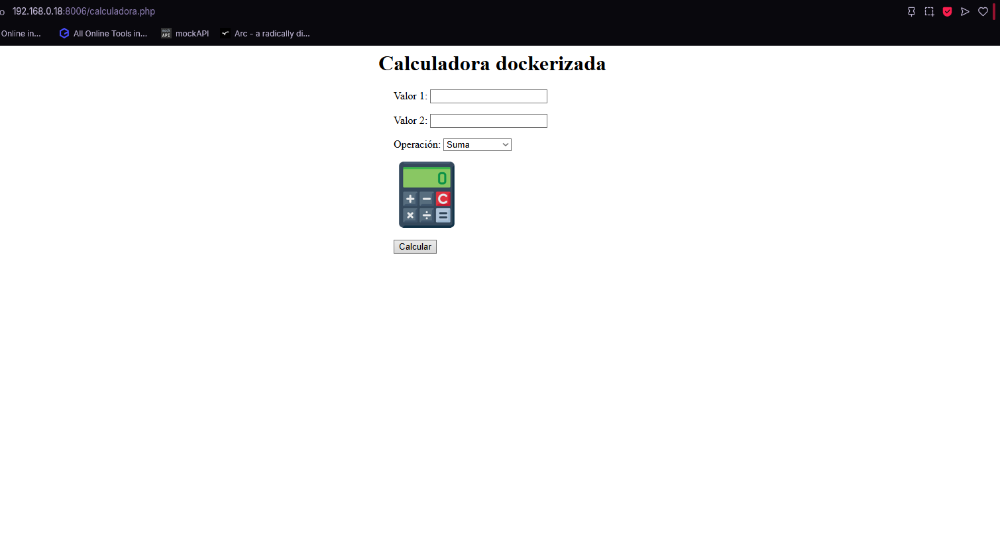

<center>

# UT2-A1 Implantación de arquitecturas web


</center>

***Nombre:*** Javier Marcelo Cedrés González
***Curso:*** 2º de Ciclo Superior de Desarrollo de Aplicaciones Web.

### ÍNDICE

+ [Introducción](#id1)
+ [Objetivos](#id2)
+ [Material empleado](#id3)
+ [Desarrollo](#id4)
+ [Conclusiones](#id5)


#### ***Introducción***. <a name="id1"></a>

En está práctica trabajaremos con Nginx, php y docker para desplegar una calculadora en una maquina virtual que usaremos como servidor.

#### ***Objetivos***. <a name="id2"></a>

El objetivo de esta práctica es utilizar Nginx y PHP para poder acceder una calculadora nativa y otra dockerizada desde localhost.

#### ***Material empleado***. <a name="id3"></a>

He empleado una máquina virtual como servidor y una local para poder conectarme usando ssh. En clase hemos instalado Nginx y PHP en la máquina virtual, para la calculadora dockerizada hemos instalado docker, creado una imagen y un contenedor a partir de ella.

#### ***Desarrollo***. <a name="id4"></a>

##### 1. Instalación de Nginx y PHP (nativo)

En clase nos encargamos de instalar Nginx y PHP usando los siguientes comandos:

**Nginx**
```bash
sudo apt update
sudo apt install -y curl gnupg2 ca-certificates lsb-release debian-archive-keyring
curl -fsSL https://nginx.org/keys/nginx_signing.key \ | sudo gpg --dearmor -o /etc/apt/trusted.gpg.d/nginx.gpg
echo "deb http://nginx.org/packages/debian $(lsb_release -sc) nginx" \ | sudo tee /etc/apt/sources.list.d/nginx.list > /dev/null
sudo apt update
sudo apt install -y nginx
```

```bash
sudo apt update
sudo apt install -y lsb-release ca-certificates \ apt-transport-https software-properties-common gnupg2
curl -fsSL  https://packages.sury.org/php/apt.gpg \ | sudo gpg --dearmor -o /etc/apt/trusted.gpg.d/sury.gpg
echo "deb https://packages.sury.org/php/ $(lsb_release -sc) main" \ | sudo tee /etc/apt/sources.list.d/sury-php.list
sudo apt update
sudo apt install -y php8.4-fpm
```

##### 2. Configuración Nginx (nativo)

 

Una vez instalado Nginx y PHP, creé una calculadora con las indicaciones dadas en la práctica.


Ahora, para poder ver la calculadora en el servidor, cambié la configuración por defecto de Nginx de manera que al buscar en el navegador **/** y **/calculadora.php** relacione esas direcciones con la ruta donde tengo situada mi **calculadora.php**.

También tuve que darle permisos a las carpetas en las que se encontraba mi calculadora y a la propia calculadora.

Al configurar esto ya podemos ver la calculadora mientras trabajamos desde nuestro repositorio.

 

##### 3. Instalación de docker

Al igual que con Nginx y PHP instalamos docker en clase, los comandos que usamos fueron:

```bash
sudo apt update
sudo apt install -y \ ca-certificates \ curl \ gnupg \ lsb-release
curl -fsSL https://download.docker.com/linux/debian/gpg | sudo gpg --dearmor -o /etc/apt/trusted.gpg.d/docker.gpg
echo \ "deb [arch=$(dpkg --print-architecture)] https://download.docker.com/linux/debian \ $(lsb_release -cs) stable" | sudo tee /etc/apt/sources.list.d/docker.list > /dev/null
sudo apt update
sudo apt install -y docker-ce docker-ce-cli containerd.io docker-compose-plugin
```

##### 4. Preparación del entrono dockerizado

 

El primer paso es crear un espacio de trabajo para crear una imagen docker pasandole los archivos necesarios.

 

Dentro de nuestro espacio de trabajo creamos un Dockerfile con las instrucciones que queremos que ejecute nuestra imagen.

**Lo que hacen estos comandos son:**

```
Crear nuestra imagen apartir de otra imagen base, en este caso una debian sin nada adicional
Actualizar la lista de paquetes disponibles
Instalar Nginx
Instalar PHP-FPM 8.4
Copiar calculadora.php, styles.css y calculadora.png en /var/
Copiar default.conf en /etc/nginx/sites-available/default *La ruta donde está la configuración de Nginx*
Darle permisos a calculadora.php
Exponer el puerto 80
CMD define el comando que se va a ejecutar cuando se inicie el contenedor, por tanto al iniciar el contenedor se levantaran los servicios de PHP y Nginx
```


Este es el archivo de configuración para Nginx que copiamos en nuestro contenedor usando el Dockerfile, en el especificamos la ruta que queremos que vigile Nginx y el archivo, también incluimos la configuración de PHP.


Creamos una imagen mediante docker build.


Y por último creamos el contenedor a partir de esa imagen.



##### Dificultades

La dificultad que tuve fue que instalé una versión de Nginx distinta a la que instalamos en clase a la hora de hacer la parte dockerizada, lo solucione buscando mi problema en Google, gracias a un post en Stack Overflow ví que la ruta correcta era **/etc/nginx/sites-available/default** en lugar de **/etc/nginx/conf.d/default.conf**

#### ***Conclusiones***. <a name="id5"></a>

Gracias a esta tarea he aprendido a manejar docker(crear imagenes, contenedores, configurar imagenes con Dockerfile, etc.) y Nginx.
