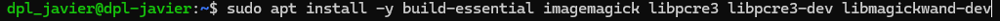
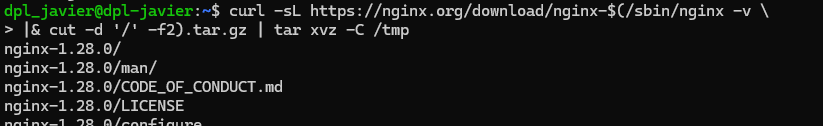
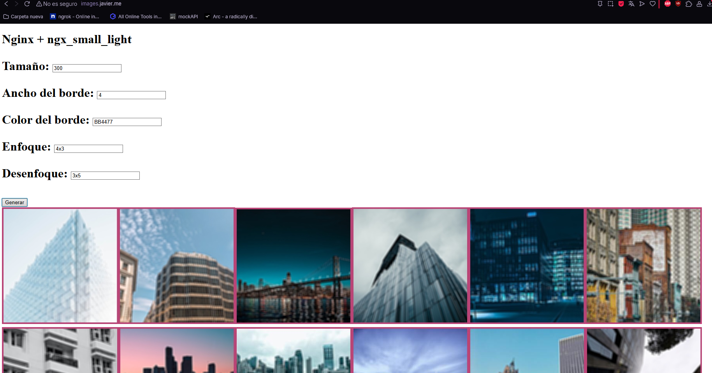

# UT3-A1: Administración de servidores web

***Nombre:*** Javier Marcelo Cedrés González
***Curso:*** 2º de Ciclo Superior de Desarrollo de Aplicaciones Web.

### ÍNDICE

+ [Introducción](#id1)
+ [Objetivos](#id2)
+ [Material empleado](#id3)
+ [Desarrollo](#id4)
+ [Conclusiones](#id5)

#### ***Introducción***. 

En está práctica trabajaremos con Nginx y docker para ver el funcionamiento de modulos de nginx y sus configuraciones.

#### ***Objetivos***. 

El objetivo de esta práctica es utilizar Nginx e implementar un módulo para poder trabajar con imágenes.

#### ***Material empleado***. 

He empleado una máquina virtual como servidor y una local para poder conectarme usando ssh.

#### ***Desarrollo***. 

##### 1. Descarga del módulo y librerías necesarias

Lo primero que hice fue instalar las librerias necesarias para que el módulo funcionase.

Luego descargué el código fuente de Nginx con la misma versión que tengo instalada en el sistema, ya que un módulo dinámico debe compilarse exactamente contra la misma versión de Nginx.

El siguiente paso fue clonar el repositorio del módulo, yo lo cloné en ``/tmp/ngx-small_light``.

##### 2. Configuración de Nginx y el módulo

Luego de clonar el repositorio, generé su configuración haciendo uso de ``./setup``.

Preparé la compilación del módulo especificando que debe se un módulo dinámico.

Después de preparar la compilación, hice ``make modules`` para que se compilen los módulos dinámicos.

``make modules`` generó el objeto ``.so``, ese fichero es el que usaremos en la configuración de Nginx, lo que hice fue moverlo a la carpeta desde la que se cargan los módulos dinámicos de Nginx.

Por último, especifiqué en el fichero de configuración de Nginx que cargue ese módulo.

##### 3. Creación del virtual-host

En el fichero de configuración del virtual-host especifique varias cosas; el nombre del servidor, la ruta en la que debe buscar los ficheros y un location ``/img`` en el cual está activido el módulo y una configuración adicional de este para habilitar consultas GET.

##### 4. HTML/Javascript

Una vez todo configurado, creé el fichero index.html que se cargará en ``/``, el código funciona de tal manera que hay un formulario con opciones para modificar el estilo de las fotos, una vez pulsado el botón de generar aparecen todas las imagenes teniendo como ruta el location especificado anteriormente en el ``.conf`` más el nombre de la foto y diversos parametros, recogidos del formulario, que ofrece el módulo para modificar las imagenes.

##### 5. Redirección

Adicionalmente creé otro fichero de configuración virtual-host para redirigir desde el subdominio ``www`` a el dominio principal.

##### 6. Docker

La parte de docker es idéntica a la local pero con alguna diferencia.

Lo primero que hice fue crear un Dockerfile que usa un debian 12 como base, instala las librerías necesarias para el módulo y Nginx y copia las imagenes y el index dentro del contenedor.

Creo una imagen a partir de ese Dockerfile, un contenedor y entro en él. Una vez dentro del contenedor seguí los mismos pasos que en local.

En esta ocasión, debemos incluir el puerto en la ruta para poder ver la página del contenedor docker.

Por último, para poder compartir ese contenedor ya configurado, debemos crear una imagen de él usando ``docker commit``.

Usamos ``docker tag`` para vincular el contenedor con el nombre especificado.

Nos logeamos para poder subir la imagen a docker hub.

Subimos la imagen a docker hub.

#### ***Conclusiones***. 

Gracias a esta tarea he aprendido a manejar y configurar modulos en Nginx y a subir imagenes a docker hub.
