

# UT4-A2 Administración de servidores de aplicaciones ( PostgreSQL )

***Nombre:*** Javier Marcelo Cedrés González

***Curso:*** 2º de Ciclo Superior de Desarrollo de Aplicaciones Web.

### ÍNDICE

+ [Objetivos](#id2)
+ [Material empleado](#id3)
+ [Desarrollo](#id4)

#### ***Objetivos***. 

Tener una aplicación PHP en una máquina para desarrollo y otra en una máquina de producción, conectarse a una base de datos y usar pgadmin en ambas máquinas.

#### ***Material empleado***. 

Dos máquinas, una para desarrollo y otra para producción.

#### ***Desarrollo***. 

##### 1. Instalar PostgreSQL, crear una base de datos travelroad con datos, virtual host nginx.

**En la máquina de desarrollo:** La instalación de PostgreSQL, la creación de la base de datos y la carga de datos ya fueron hechas en la práctica 1 del tema 4 [UT4A1](https://github.com/JavierCedres/dpl_javier/blob/main/ut4/a1/README.md).

Creación del virtual host:

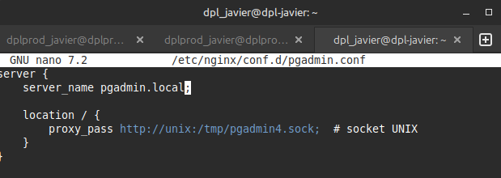

Conectar servidor con la base de datos:

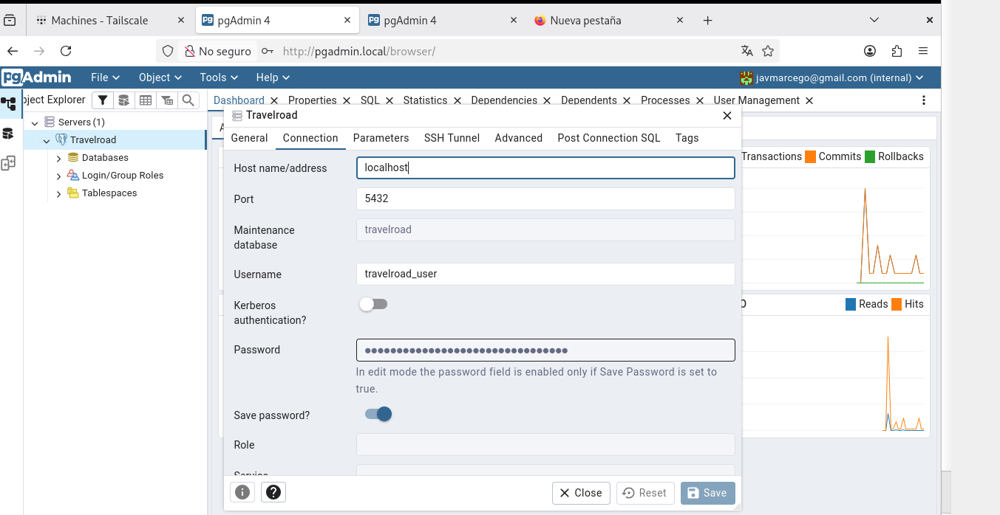

**URL pgadmin:** http://pgadmin.local

**En la máquina de producción:** La instalación de PostgreSQL es exactamente igual que en la máquina de desarrollo, para la base de datos la creación y la carga de datos son iguales pero en esta ocasión creamos un usuario con distintas credenciales.

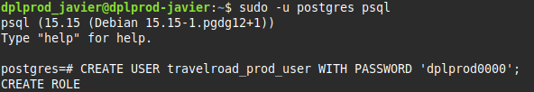

El virtual host de producción es el mismo pero cambiando el nombre del dominio:

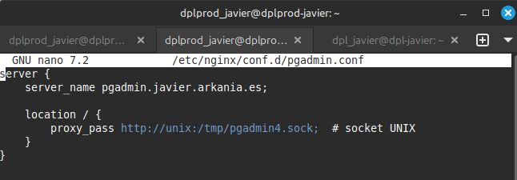

Conectar servidor con la base de datos:

**URL pgadmin:** http://pgadmin.javier.arkania.es

##### 2. Aplicación PHP en entorno de desarrollo

Para poder hacer la aplicación PHP necesitaremos conectarnos a la base de datos con pg_connect, para ello tenemos que instalar `php8.4-pgsql`:

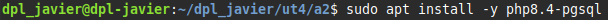

Creamos la aplicación PHP dentro de nuestro repositorio:

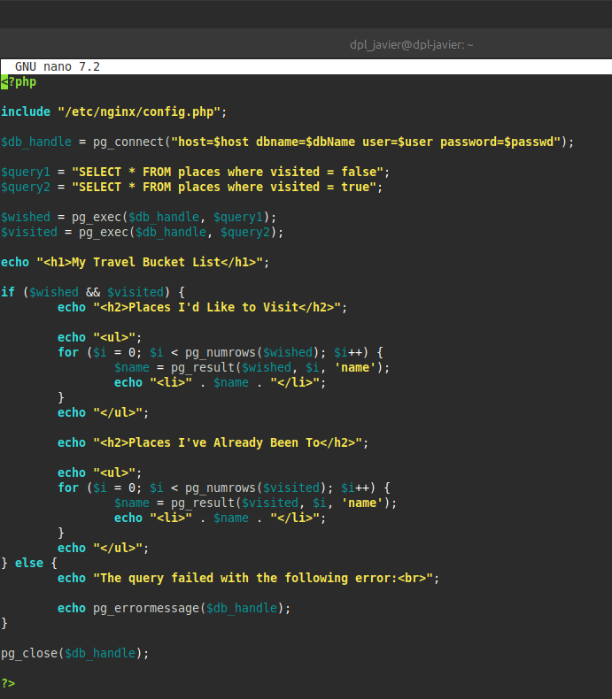

Añadimos un virtual host y lo configuramos con server_name **php.travelroad.local**, php y nuestra aplicación php para poder verla en el navegador:

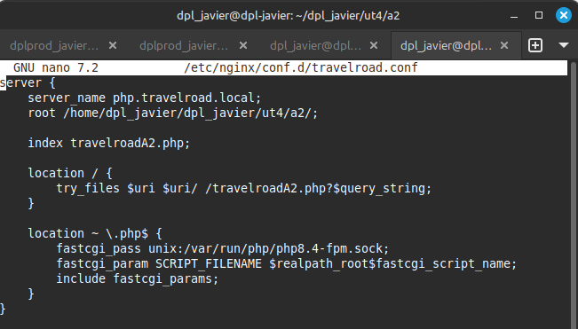

Para que no se suban la contraseña y el usuario de nuestra base de datos a Github creamos otro fichero fuera del repositorio y lo incluimos en la aplicación php con **include**:

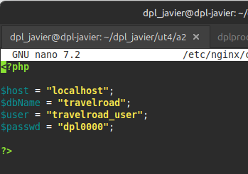

[Código fuente aplicación PHP](https://github.com/JavierCedres/dpl_javier/blob/main/ut4/a2/travelroadA2.php)

##### 3. Aplicación PHP en entorno de producción

Lo primero que hacemos es clonar el repositorio en el que hemos creado la aplicación:

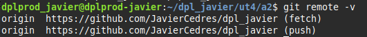

Creamos el fichero en el que se encontrarán las credenciales de la base de datos de producción:

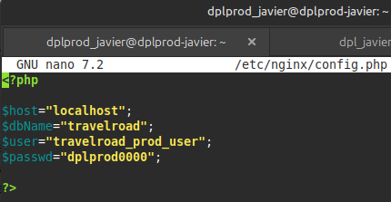

Añadimos un virtual host igual que el de la máquina de desarrollo pero con distinto server_name:

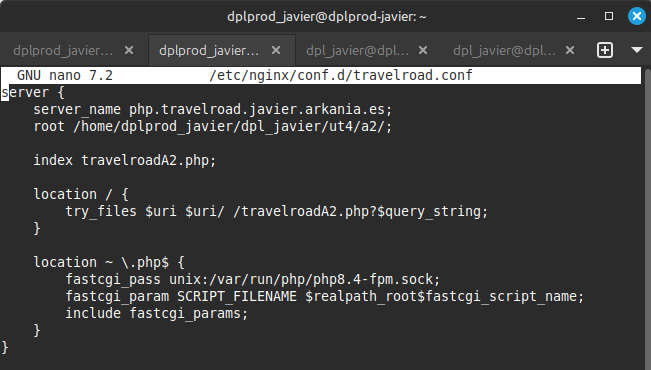

Y por último creamos una redirección desde www hasta nuestro servidor:

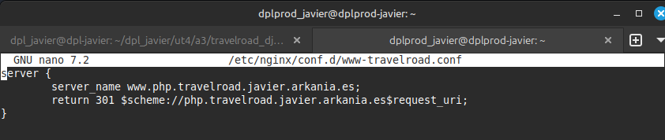

**Aplicación PHP en producción:** http://php.travelroad.javier.arkania.es

##### 4. Script de despliegue

Para acabar hacemos un script que se conecte a la máquina de producción y haga un ``git pull`` para traer los cambios en el repositorio:

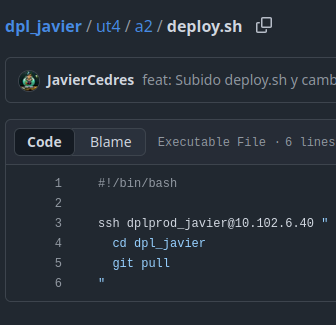

Le damos permisos de ejecución:

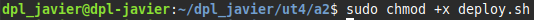

Para comprobar que funciona realizamos algún cambio y ejecutamos el script:

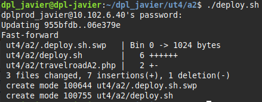

Adicionalmente podemos pasarle a la máquina de producción nuestra clave pública para poder conectarnos sin que nos pida la contraseña:

