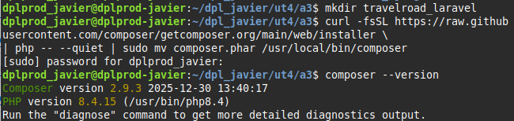
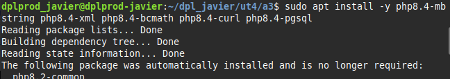
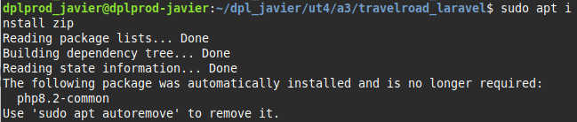
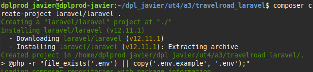
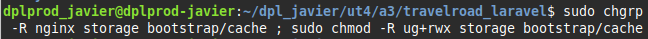
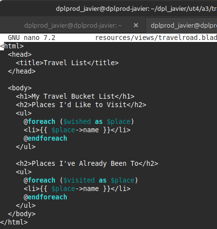
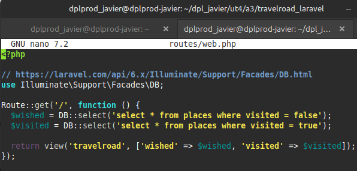
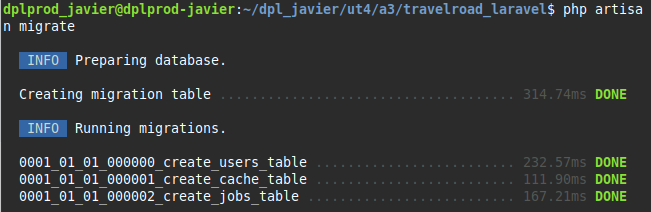
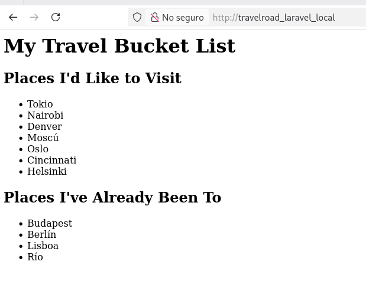

<center>

# UT4-A3 Administración de servidores de aplicaciones (Laravel)


</center>

***Nombre:*** Javier Marcelo Cedrés González

***Curso:*** 2º de Ciclo Superior de Desarrollo de Aplicaciones Web.

### ÍNDICE

+ [Objetivos](#id2)
+ [Material empleado](#id3)
+ [Desarrollo](#id4)

#### ***Objetivos***. <a name="id2"></a>

Tener una aplicación hecha en laravel en una máquina para desarrollo y otra en una máquina de producción.

#### ***Material empleado***. <a name="id3"></a>

Dos máquinas, una para desarrollo y otra para producción.

#### ***Desarrollo***. <a name="id4"></a>

**Aplicación desplegada:** http://laravel.travelroad.javier.arkania.es

**En la máquina de desarrollo:**

##### 1. Instalación de Composer.

Lo primero que necesitamos es un gestor de dependencias para PHP, en este caso utilizaremos **Composer** y lo instalaremos con el siguiente comando:

```bash
curl -fsSL https://raw.githubusercontent.com/composer/getcomposer.org/main/web/installer | php -- --quiet | sudo mv composer.phar /usr/local/bin/composer
```



##### 2. Instalación dependencias php y zip.

A continuación instalaremos varias dependencias de php y el paquete zip para poder ejecutar composer install más adelante.




##### 3. Creación del proyecto laravel.

Se crea el proyecto laravel con el siguiente comando:



##### 4. Modificación variables de entorno.

Modificamos algunas de las variables de entorno de la aplicación para que encuentre nuestra base de datos y se pueda conectar a ella.


##### 5. Configuración de **Nginx**.

Lo primero que debemos hacer es fijar los permisos adecuados en los ficheros del proyecto que usaran los servicios **Nginx** y **PHP-FPM** para que puedan acceder a ellos.



Ahora debemos crear un virtual host para nuestra aplicación.


##### 6. Desarrollo de la aplicación.

Una vez configurado todo podemos empezar con el desarrollo de la aplicación.

**View:**



**Routes:**



##### 7. php artisan migrate.

Un paso muy importante es ejecutar ``php artisan migrate`` en nuestro proyecto, este comando realiza las migraciones de nuestra aplicación, si no lo hacemos el proyecto no funcionará debido a porblemas relacionados con la base de datos.



##### 8. Aplicación en funcionamiento.

Al realizar todos los pasos anteriores nuestra aplicación laravel ya está en funcionamiento.



**En la máquina de producción:** 

##### 1. Clonación del proyecto.

El primer paso a realizar en la máquina de producción es la clonación del proyecto haciendo uso de git, en mi caso:

```bash
git clone https://github.com/JavierCedres/dpl_javier
```

##### 2. Composer install.

Laravel genera una carpeta llamada vendor que es necesaria para el funcionamiento del proyecto, esta carpeta no se sube al control de versiones, por lo tanto, debemos ejecutar el comando ``composer install`` para que se vuelva a generar.


##### 3. Script de deploy.

Por último crearemos un script de deploy que haga un push de los cambios al control de versiones, se conecte a la máquina de producción, traiga los cambios del control de versiones y ejecute un composer install.


##### 4. Cambio en el proyecto.

Como paso adicional cambiaremos un poco el código de la aplicación, de forma que ahora existirán 3 vistas: la inicial, los lugares visitados y los lugares por visitar.

**Routes:**


**Index**


**Wished:**


**Visited:**


##### 5. Script de despliegue en funcionamiento.


